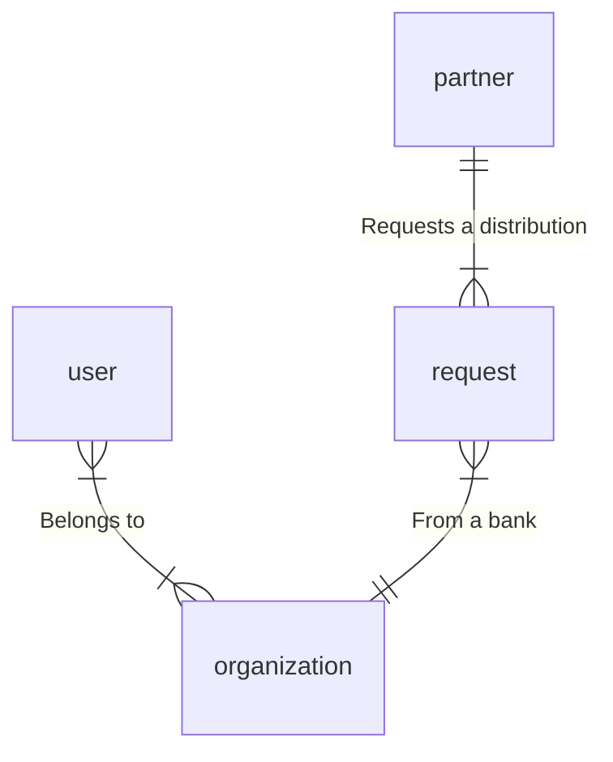
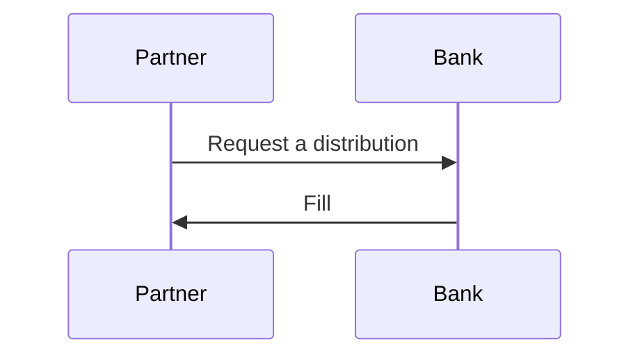
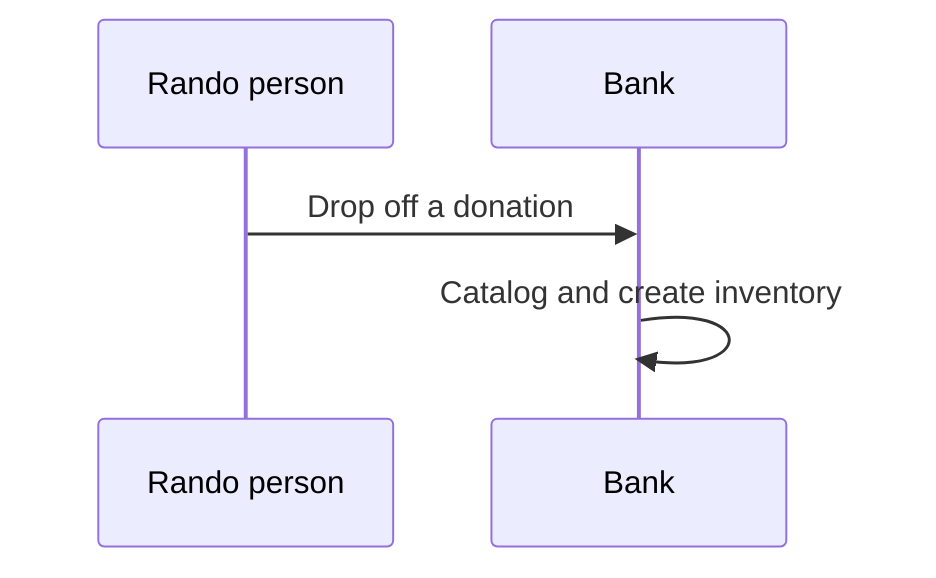

This is a practice page for diagrams. **These are not accurate!** This is using the built-in [Mermaid Declarative Diagrams](https://mermaid-js.github.io/mermaid/) syntax.

## Core relationships

## Partner Request Workflow

